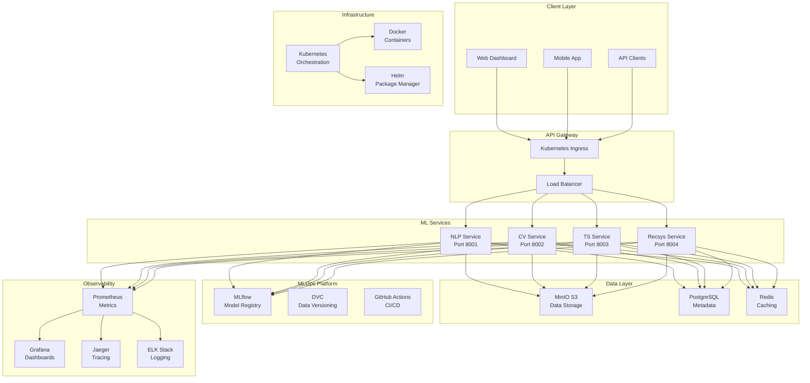
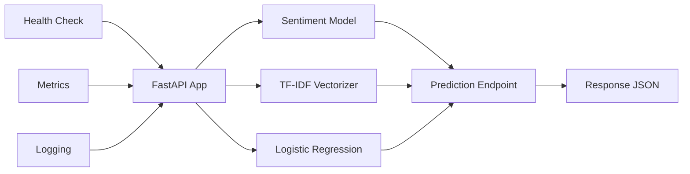
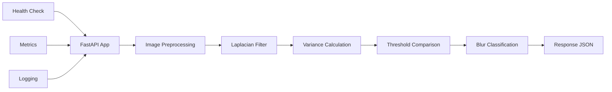
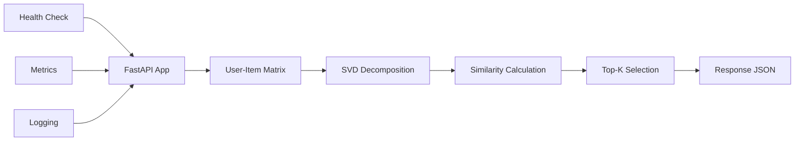
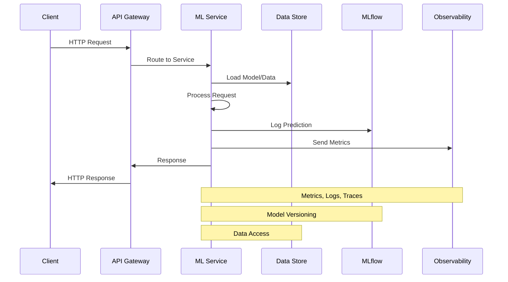
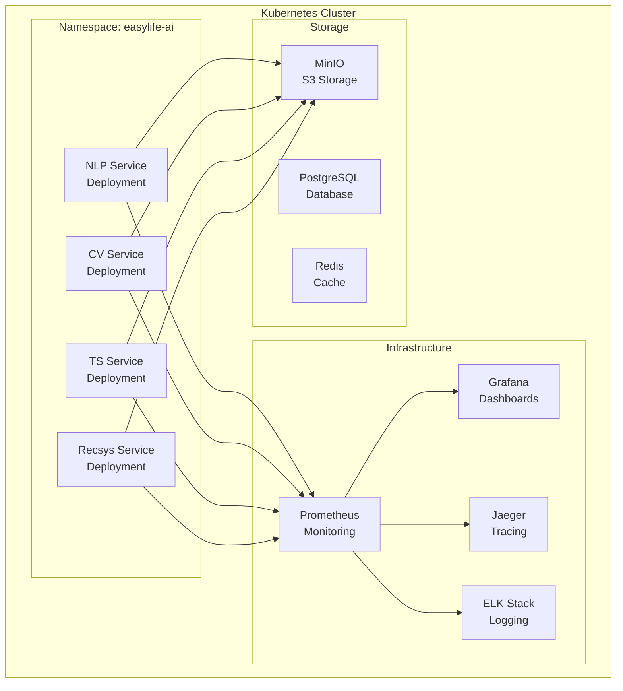
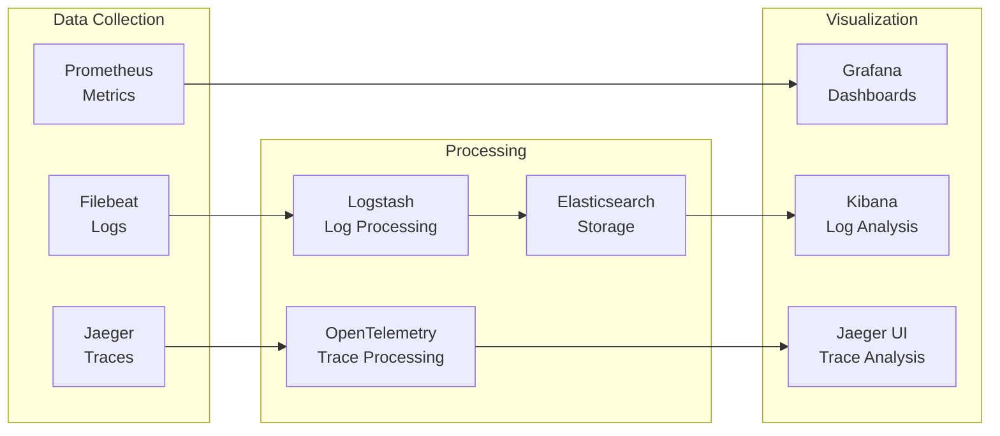
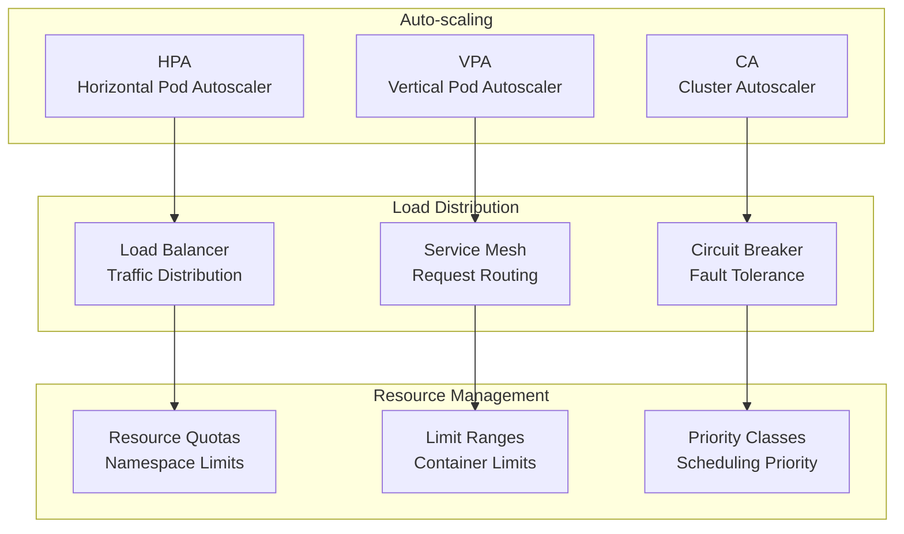

# EasyLife AI System Architecture

## High-Level Architecture

## Service Architecture

### NLP Service Architecture

### Computer Vision Service Architecture

### Time Series Service Architecture

### Recommendation Service Architecture

## Data Flow Architecture

## Deployment Architecture

### Kubernetes Deployment

## Security Architecture

```mermaid
graph TB
    subgraph "Security Layers"
        A[API Gateway<br/>Rate Limiting]
        B[Service Mesh<br/>mTLS]
        C[RBAC<br/>Access Control]
        D[Secrets Management<br/>Kubernetes Secrets]
    end

    subgraph "Network Security"
        E[Network Policies<br/>Traffic Control]
        F[Ingress Controller<br/>SSL Termination]
        G[Service Discovery<br/>Internal DNS]
    end

    subgraph "Data Security"
        H[Encryption at Rest<br/>MinIO S3]
        I[Encryption in Transit<br/>TLS 1.3]
        J[Data Masking<br/>PII Protection]
    end

    A --> B
    B --> C
    C --> D

    E --> F
    F --> G

    H --> I
    I --> J
```

## Monitoring Architecture

## Scalability Architecture

## Technology Stack

### Core Technologies
- **Containerization**: Docker
- **Orchestration**: Kubernetes
- **Service Mesh**: Istio
- **API Gateway**: NGINX Ingress
- **Load Balancing**: HAProxy

### ML Technologies
- **MLOps**: MLflow, DVC
- **Frameworks**: Scikit-learn, OpenCV, Statsmodels
- **Languages**: Python 3.10
- **APIs**: FastAPI, Uvicorn

### Data Technologies
- **Storage**: MinIO S3, PostgreSQL
- **Caching**: Redis
- **Message Queue**: Apache Kafka
- **Search**: Elasticsearch

### Observability
- **Metrics**: Prometheus
- **Visualization**: Grafana
- **Tracing**: Jaeger
- **Logging**: ELK Stack

### Security
- **Secrets**: Kubernetes Secrets
- **Scanning**: Trivy
- **Network**: Calico CNI
- **Authentication**: OAuth2, JWT

---

*This architecture provides a comprehensive view of the EasyLife AI system, demonstrating production-ready design patterns and best practices for ML systems at scale.*
